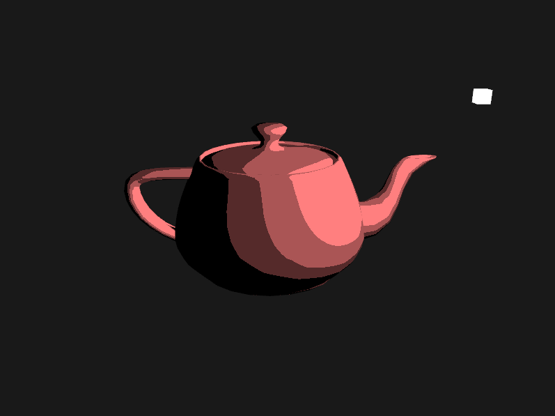
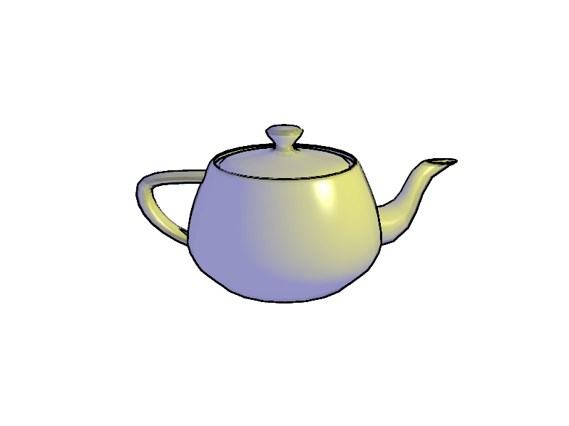

# Non-Photorealistic GLSL Shaders

An OpenGL program that showcases non-photorealistic rendering techniques in real time, including toon/cel shading, Gooch shading (technical illustration), 
and pencil hatching.

## Keyboard and Mouse Input Controls

Esc - End program.  
W,A,S,D,Q,E - Forward, backward, left, right, up, down.  
Tab - Change model.

### Effects

1 - Toon Shading.  
2 - Gooch Shading.  
3 - Pencil Hatching.  
4 - Phong shading. (Not 'non-photorealistic,' but included for default purposes)  

## Results

### Toon Shading

### Gooch Shading

## OpenGL, Graphics, and Math Topics Used

GLFW, Vertex Array Objects, Vertex Buffer Objects, Uniform Buffer Objects, Framebuffer Objects, Creating Textures and Sampling in Shaders, Shader Compilation,
Anti-Aliasing, Mipmaps, Multi-Pass Rendering, Transformations and Coordinate Systems, Sobel Filter (for generating contour and silhouette outlines), Phong Lighting,

## Shortcomings

Lapped textures

## References

### For GLFW and glad, Window Setup, and Overall OpenGL Reference:
https://learnopengl.com/

### Gooch Shading:
https://users.cs.northwestern.edu/~bgooch/PDFs/gooch98.pdf  
https://rendermeapangolin.wordpress.com/2015/05/07/gooch-shading/  

### Sobel Filter and Edge Detection
https://www.cs.mcgill.ca/~cs767/papers/saito90.pdf  
http://www-evasion.inrialpes.fr/people/Philippe.Decaudin/Publis/RR-2919-en.pdf  
	
#### Supplementary Edge Detection Resources:
https://gamedev.stackexchange.com/questions/68401/how-can-i-draw-outlines-around-3d-models  
https://www.vertexfragment.com/ramblings/unity-postprocessing-sobel-outline/  
https://rastergrid.com/blog/2011/01/frei-chen-edge-detector/  
https://computergraphics.stackexchange.com/questions/3646/opengl-glsl-sobel-edge-detection-filter  
  
### Pencil Hatching
http://hhoppe.com/hatching.pdf  
http://kylehalladay.com/blog/tutorial/2017/02/21/Pencil-Sketch-Effect.html
