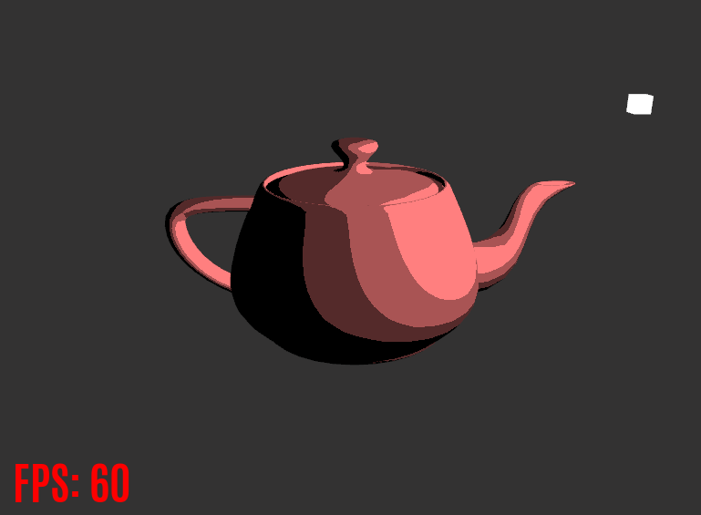

# Non-Photorealistic GLSL Shaders

An OpenGL program that showcases non-photorealistic rendering (NPR) techniques in real time, including toon/cel shading, Gooch shading (technical illustration), 
and cross-hatching.

## Input Controls

### Mouse
Move the mouse to change the camera view direction.  
Use the scroll wheel to zoom in and out.  

### Keyboard

<kbd>Esc</kbd> - End program.  
<kbd>W</kbd><kbd>A</kbd><kbd>S</kbd><kbd>D</kbd> - Move the camera forward, backward, left, right.  
<kbd>Q</kbd><kbd>E</kbd> - Move the camera up and down.  
<kbd>R</kbd> - Reset the camera to its original zoom and position.  
<kbd>Space</kbd> - Automatically rotate the light around the teapot. Toggle on/off. Gooch Shading: Automatically rotate the teapot around its Y-axis.  
<kbd>←</kbd><kbd>→</kbd> - Manually rotate the light around the teapot either clockwise or counter-clockwise. Gooch Shading: Manually rotate the teapot around its Y-axis.  
  
<kbd>1</kbd> - Toon Shading.  
<kbd>2</kbd> - Gooch Shading.  
<kbd>3</kbd> - Cross-Hatching.  
<kbd>4</kbd> - Phong shading. (Included as the default shader)  
<kbd>N</kbd> - Display the normal vectors on the teapot. Toggle on/off. Doesn't work with Gooch Shading.  

## Implementation

### Libraries

- [GLFW](https://www.glfw.org/) is used to create the windowing system and to receive inputs.  
- [GLAD](https://glad.dav1d.de/) is used to load pointers to OpenGL functions.  
- [GLM](https://glm.g-truc.net/0.9.9/index.html) is used to perform 3D math.  
- [Assimp](http://www.assimp.org/) is used to load 3D models.  
- [stb_image](https://github.com/nothings/stb) is used to load textures.  
- [FreeType](https://www.freetype.org/) is used to display text on the screen.  

### Toon Shading
<p align="center">
  
</p>  

A simple toon shader that computes the diffuse light intensity using the Phong lighting model and creates the color steps using the ceil function:  
```glsl
float diffuse = dot(normal, lightDir);
float diffuseToon = max(ceil(diffuse * float(numColorSteps)) / float(numColorSteps), 0.0);
vec3 toonColor = diffuseToon * lightColor * objectColor;
```

### Gooch Shading

<p align="center">
  
</p>  

[Gooch shading](https://users.cs.northwestern.edu/~bgooch/PDFs/gooch98.pdf) is a technique designed for technical illustration, where readability of the object is more important than photorealistic accuracy. Since dark shadows can hide fine details in the surface, cool-to-warm shading is used to indicate surface orientation. Edge lines provide divisions between object pieces and specular highlights convey the direction of the light.  
  
I use two rendering passes in my implementation. The first pass computes the cool-to-warm shading and stores the color, normal, and depth images of the scene into 3 separate textures. In the second pass, I apply the Sobel operator to the normal and depth textures to detect silhouette and interior edge lines and then draw the combined result to a white quad that covers the screen. Artifacts are still present in the edge detection though, so it still needs to be refined. I think I need to adjust the detection threshold for discontinuities as the zoom value changes, since it seems to improve as you zoom or dolly in.
  
[Here's a still image](https://github.com/kwandrus/Non-Photorealistic-GLSL-Shaders/blob/master/Results/GoochShading.PNG) of the Gooch shader that shows a smoother transition in color compared to the gif.  

### Cross-Hatching

<p align="center">
  
</p>  

Following [this](https://hhoppe.com/hatching.pdf) real-time hatching paper, I construct a tonal art map (TAM) using 6 mip-mapped hatch images corresponding to different tones. In the fragment shader, I first compute the diffuse light intensity using the Phong lighting model and then blend between the 2 hatching tones nearest to that intensity.  
  
One shortcoming of my implementation is that the hatching lines don't adjust to the curvature of the teapot, primarily seen in the handle and spout. Here are a couple papers that provide algorithms to address this problem:
-  [Lapped Textures](https://hhoppe.com/lapped.pdf) by Emil Praun, Adam Finkelstein, and Hugues Hoppe. ACM SIGGRAPH 2000 Proceedings.
-  [Illustrating Smooth Surfaces](https://cims.nyu.edu/~dzorin/papers/hertzmann2000iss.pdf) by Aaron Hertzmann and Denis Zorin. ACM SIGGRAPH 2000 Proceedings.

## References

### For GLFW and glad, Window Setup, and Overall OpenGL Reference
https://learnopengl.com/

### NPR Resources
Non-Photorealistic Rendering by Bruce & Amy Gooch (book, 2001)  
Non-Photorealistic Computer Graphics by Thomas Strothotte & Stefan Schlechtweg (book, 2002)

### Gooch Shading
https://users.cs.northwestern.edu/~bgooch/PDFs/gooch98.pdf  
https://rendermeapangolin.wordpress.com/2015/05/07/gooch-shading/  

### Sobel Filter and Edge Detection
https://www.cs.mcgill.ca/~cs767/papers/saito90.pdf  
http://www-evasion.inrialpes.fr/people/Philippe.Decaudin/Publis/RR-2919-en.pdf  
	
#### Supplementary Edge Detection Resources
https://gamedev.stackexchange.com/questions/68401/how-can-i-draw-outlines-around-3d-models  
https://www.vertexfragment.com/ramblings/unity-postprocessing-sobel-outline/  
https://rastergrid.com/blog/2011/01/frei-chen-edge-detector/  
https://computergraphics.stackexchange.com/questions/3646/opengl-glsl-sobel-edge-detection-filter  
  
### Cross-Hatching
http://hhoppe.com/hatching.pdf  
http://kylehalladay.com/blog/tutorial/2017/02/21/Pencil-Sketch-Effect.html  
https://sites.google.com/site/cs7490finalrealtimehatching/home
