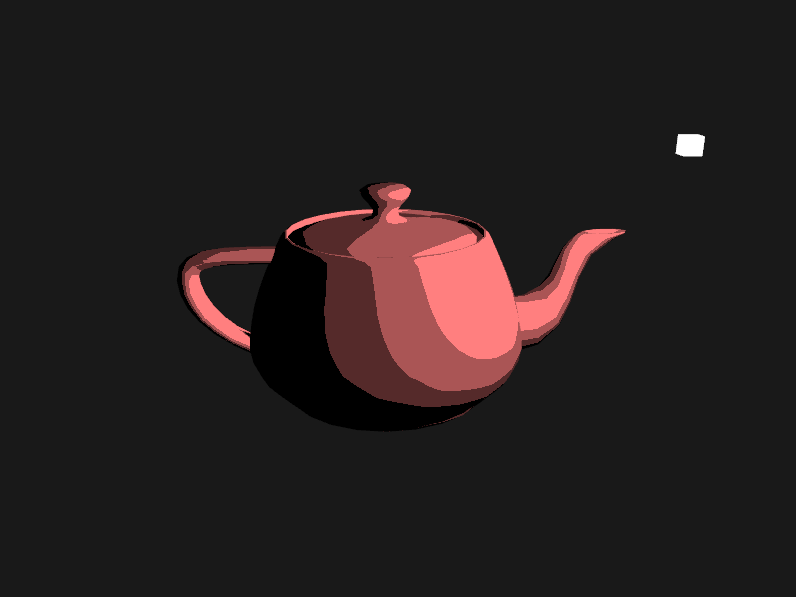

# Non-Photorealistic GLSL Shaders

An OpenGL program that showcases non-photorealistic rendering techniques in real time, including toon/cel shading, Gooch shading (technical illustration), 
and pencil hatching.

## Input Controls

### Mouse
Move the mouse to change the camera view direction.  
Use the scroll wheel to zoom in and out.  

### Keyboard

<kbd>Esc</kbd> - End program.  
<kbd>W</kbd><kbd>A</kbd><kbd>S</kbd><kbd>D</kbd> - Move the camera forward, backward, left, right.  
<kbd>Q</kbd><kbd>E</kbd> - Move the camera up and down.  
<kbd>R</kbd> - Reset the camera to its original position.  
<kbd>←</kbd><kbd>→</kbd> - Rotate the light around the model.  
  
<kbd>1</kbd> - Toon Shading.  
<kbd>2</kbd> - Gooch Shading.  
<kbd>3</kbd> - Pencil Hatching.  
<kbd>4</kbd> - Phong shading. (Not 'non-photorealistic,' but included as the default shader)  
<kbd>N</kbd> - Display the normal vectors on the model. Toggle for on/off. Doesn't work with Gooch Shading.  

## Implementation

### Libraries

- [GLFW](https://www.glfw.org/) is used to create the windowing system and to receive inputs.  
- [GLAD](https://glad.dav1d.de/) is used to load pointers to OpenGL functions.  
- [GLM](https://glm.g-truc.net/0.9.9/index.html) is used to perform 3D math.  
- [Assimp](http://www.assimp.org/) is used to load 3D models.  
- [stb_image](https://github.com/nothings/stb) is used to load textures.  
- [FreeType](https://www.freetype.org/) is used to display text on the screen.  

### Toon Shading

  

### Gooch Shading

  
sobel filter applied to normal and depth images of the scene to detect silhouette and contour lines, artifacts, multi-pass rendering

### Pencil Hatching

calculated light intensity using Phong lighting model, tonal art map consisted of 6 mipmapped texture images, blended between the 2 textures nearest to the intensity. One shortcoming of my implementation is that the hatching lines don't adjust to the curvature of the model largely seen in the handle and spout. This can be addressed using lapped textures, as described in [this](http://hhoppe.com/lapped.pdf) paper, which I eventually plan on implementing.  

## References

### For GLFW and glad, Window Setup, and Overall OpenGL Reference
https://learnopengl.com/

### NPR Resources
Non-Photorealistic Rendering by Bruce & Amy Gooch (book, 2001)  
Non-Photorealistic Computer Graphics by Thomas Strothotte & Stefan Schlechtweg (book, 2002)

### Gooch Shading
https://users.cs.northwestern.edu/~bgooch/PDFs/gooch98.pdf  
https://rendermeapangolin.wordpress.com/2015/05/07/gooch-shading/  

### Sobel Filter and Edge Detection
https://www.cs.mcgill.ca/~cs767/papers/saito90.pdf  
http://www-evasion.inrialpes.fr/people/Philippe.Decaudin/Publis/RR-2919-en.pdf  
	
#### Supplementary Edge Detection Resources
https://gamedev.stackexchange.com/questions/68401/how-can-i-draw-outlines-around-3d-models  
https://www.vertexfragment.com/ramblings/unity-postprocessing-sobel-outline/  
https://rastergrid.com/blog/2011/01/frei-chen-edge-detector/  
https://computergraphics.stackexchange.com/questions/3646/opengl-glsl-sobel-edge-detection-filter  
  
### Pencil Hatching
http://hhoppe.com/hatching.pdf  
http://kylehalladay.com/blog/tutorial/2017/02/21/Pencil-Sketch-Effect.html  
https://sites.google.com/site/cs7490finalrealtimehatching/home
